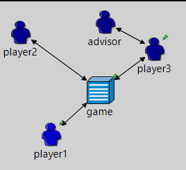
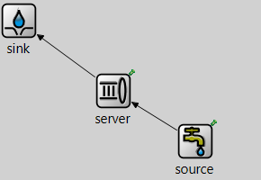
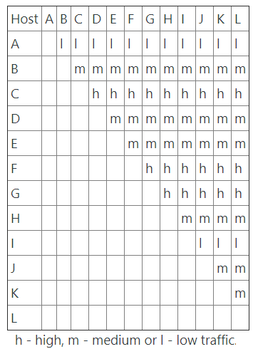
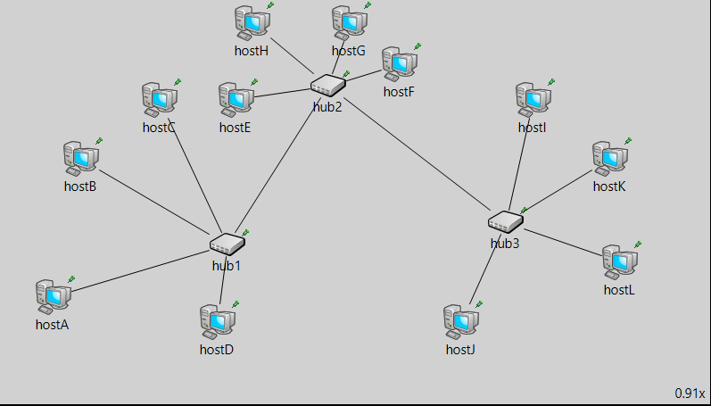

# Omnet-Basic-Implementation
Various basic Omnet++ Concepts Implemented.

# NIM Game
NIM is a simple game of strategy in which a few players take turns removing sticks from the heap of sticks on the table. On each turn, a player must remove 1-4 sticks. The purpose of the game is not to be the last one, i.e. the player, who finds one stick on the table and must take it, loses the game.

# Single Server Queue
A single-queue server that process tasks from source to sink, with analysis of parameters such as waiting time and queue size among others.

# Queue with finite buffer and losses

# INET and Ethernet 
The table presents statistical amount of traffic volume sent among 12 workstations. Each pair of stations exchanges h - high, m - medium or l - low traffic. We don't differentiate between sent and received traffic for workstations. Having at most three EtherHub at you disposal, propose a network topology which is the most suitable for connecting the workstations. Take into account number of collisions and utilisation of hubs and links. There should be a connection between every pair of workstations. In order to manipulate traffic volume use sendInterval attribute. Propose the solution as a .ned file

